> **Draft, not v1.** 20 recipes so far, more in progress. Clips are reference renders on grey, not final assets.

Back to [Sandworm DESIGN.md](../DESIGN.md) · Browse the clips on the site: **Mascot → Dibs motion** (`/dibs`)

# Dibs motion recipes

Recipes, not ingredients. Each card is a prompt plus the clip that prompt produced: watch the clip to see what you'll get, copy the prompt to make your own. Every recipe was approved from the rendered clip, not from the text.

## How to make one

- **Model:** H3 Max Turbo on fal, endpoint `minimax/h3-max-turbo/image-to-video`. Cheap (about 1.5 to 2.5 cents a second at 480P) and fast (seconds per clip), so iterate here. Move to a pricier model (Seedance 2.5) only once a motion is approved and you need more quality.
- **Keyframe:** use the approved still [`keyframe-seated-3q.png`](../public/dibs/motion/keyframe-seated-3q.png) as **both** the first and the last frame. That keeps Dibs on-model and makes the clip loop.
- **Entrances and exits:** use the empty plate [`empty-plate.png`](../public/dibs/motion/empty-plate.png) (the same grey, no Dibs) as the first frame for an entrance or the last frame for an exit, and the keyframe for the other end.
- **Settings:** 480P while iterating, prompt rewriting **off**, and keep the **seed** listed on the card. The same words can move differently on another seed.

```bash
# FAL_KEY in your env; image is a data: URI or a public URL of the keyframe
curl -s https://queue.fal.run/minimax/h3-max-turbo/image-to-video \
  -H "Authorization: Key $FAL_KEY" -H "Content-Type: application/json" \
  -d '{"prompt": "<recipe prompt>", "image_url": "<keyframe>", "end_image_url": "<keyframe>",
       "duration": 5, "resolution": "480P", "seed": 1, "prompt_expansion_mode": "disabled"}'
# then poll the returned status_url and fetch response_url for the video URL
```

## Writing your own: the shape every recipe shares

1. **Subject:** "The cartoon jerboa"
2. **Body move:** one clear action with a count ("waves twice", "one quick, springy hop").
3. **Follow-through:** what the ears and tail do. This is what makes it read as Dibs. Example: "On the way up the ears trail behind, on landing they flop forward and settle; the tail swings for balance."
4. **Face lock:** "Eyes stay open, same face." Without it the model swaps in closed-eye grins and winks.
5. **Loop close:** "Ends in exactly the same seated pose."
6. **Stage:** "Static camera, plain grey background."

## Rules learned the hard way

- **Short and plain beats descriptive.** Long, flowery prompts make the motion worse.
- **Gestures run 3 to 4 seconds.** At 5 s, a wave drags and a cheer ends in a dead held pose.
- **Don't name what you don't want.** "No teeth" still produced teeth. Describe the body and leave the face alone.
- **Pick verbs that are pure body.** "Startles" brought in an open mouth with teeth. "Flinches: the body jolts back" kept the face.
- **Lean, don't turn.** Head turns warp the ears. "Leans forward to sniff" works.
- **Excited is slower than you think.** Three bounces in 4 s read as frantic; over 5 s with "springy, not frantic" it works.
- **Natural speed.** A big hop with long hang time reads as slow motion. Say "short hang time, at natural speed".
- **Head gestures: small, level, body still.** For a head shake, extra body motion or a tilt reads wrong. Say "small", "the head stays level and the body stays completely still". Every other motion still needs a body move.
- **Big enough to see.** A sniff or blink on its own reads as nothing happening. Pair every motion with a body move.
- **Too loose is a thing.** Telling the body to sway with the tail made it wobbly. A still body with a moving tail looked better.
- **Stay on grey.** Cutting Dibs out (AI matting, green screen and keying) was tested and dropped: edges never looked right. Renders on dark were worse. Use the grey clips as reference; final placement is a design job.

## The recipes

The strips show each clip at 3 frames a second.

### 01 Small hop

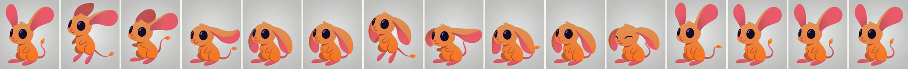

Clip: [`01-small-hop.mp4`](../public/dibs/motion/01-small-hop.mp4)

5 s · seed 1
> The cartoon jerboa does two quick small hops in place. On the way up the ears trail behind, on landing they flop forward and settle; the tail swings for balance. Ends in exactly the same seated pose. Static camera, plain grey background.

### 02 Big hop

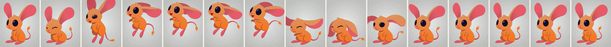

Clip: [`02-big-hop.mp4`](../public/dibs/motion/02-big-hop.mp4)

5 s · seed 1
> The cartoon jerboa does one quick, springy hop straight up in place with short hang time, at natural speed. On the way up the ears trail behind, on landing they flop forward and settle; the tail swings for balance. Ends in exactly the same seated pose. Static camera, plain grey background.

### 03 Curious sniff

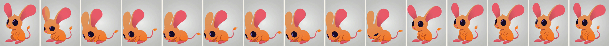

Clip: [`03-curious-sniff.mp4`](../public/dibs/motion/03-curious-sniff.mp4)

5 s · seed 1
> The cartoon jerboa leans forward to sniff, the ears swivel forward and the tail sways, then it leans back. Eyes stay open, same face. Ends in exactly the same seated pose. Static camera, plain grey background.

### 04 Tail swish

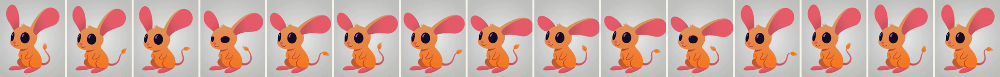

Clip: [`04-tail-swish.mp4`](../public/dibs/motion/04-tail-swish.mp4)

5 s · seed 1
> The cartoon jerboa sits still while its tail swishes side to side twice and the ears flop gently. Eyes stay open, same face. Ends in exactly the same seated pose. Static camera, plain grey background.

### 05 Wave

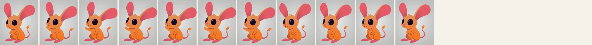

Clip: [`05-wave.mp4`](../public/dibs/motion/05-wave.mp4)

3.5 s · seed 1
> The cartoon jerboa raises one front paw and waves twice. The ears bob gently with each wave and the tail sways. Eyes stay open, same face. Ends in exactly the same seated pose. Static camera, plain grey background.

### 06 Cheer

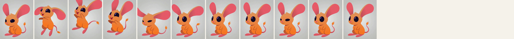

Clip: [`06-cheer.mp4`](../public/dibs/motion/06-cheer.mp4)

3.5 s · seed 1
> The cartoon jerboa bounces up with both front paws raised, then the paws come back down and it settles. The ears flop with the bounce and the tail swings. Eyes stay open, same face. Ends in exactly the same seated pose. Static camera, plain grey background.

### 07 Flinch

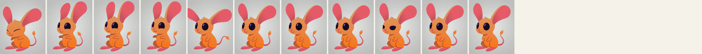

Clip: [`07-flinch.mp4`](../public/dibs/motion/07-flinch.mp4)

3.5 s · seed 1 (5 s also approved)
> The cartoon jerboa flinches: the body jolts back and the ears shoot straight up, then it relaxes, the ears flop and settle and the tail flicks. Same face throughout. Ends in exactly the same seated pose. Static camera, plain grey background.

### 08 Point

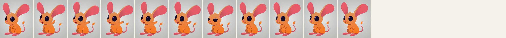

Clip: [`08-point.mp4`](../public/dibs/motion/08-point.mp4)

3.5 s · seed 1
> The cartoon jerboa points with one front paw toward the right side of the frame, the ears perk toward it, then it lowers the paw. Eyes stay open, same face. Ends in exactly the same seated pose. Static camera, plain grey background.

Points toward the right side, for UI callouts. A left point is untested.

### 09 Sad

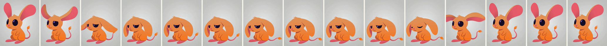

Clip: [`09-sad.mp4`](../public/dibs/motion/09-sad.mp4)

5 s · seed 1
> The cartoon jerboa's ears droop down slowly and its body slumps a little, the tail drops, then the ears lift back up and it sits up again. Ends in exactly the same seated pose. Static camera, plain grey background.

### 10 Sleepy

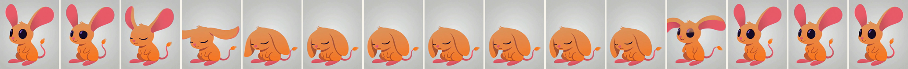

Clip: [`10-sleepy.mp4`](../public/dibs/motion/10-sleepy.mp4)

5 s · seed 1
> The cartoon jerboa slowly nods off: the head droops and the ears flop down, then it jerks back awake and sits up. Ends in exactly the same seated pose. Static camera, plain grey background.

### 11 Look up

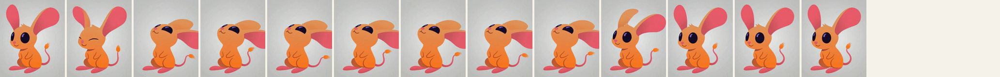

Clip: [`11-look-up.mp4`](../public/dibs/motion/11-look-up.mp4)

4 s · seed 1
> The cartoon jerboa leans back to look up, the ears swivel back and the tail sways, then it leans forward again. Eyes stay open, same face. Ends in exactly the same seated pose. Static camera, plain grey background.

### 12 Clap

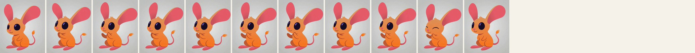

Clip: [`12-clap.mp4`](../public/dibs/motion/12-clap.mp4)

3.5 s · seed 1
> The cartoon jerboa claps its two front paws together twice, happily. The ears bob with each clap and the tail swings. Eyes stay open, same face. Ends in exactly the same seated pose. Static camera, plain grey background.

### 13 Think

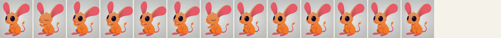

Clip: [`13-think.mp4`](../public/dibs/motion/13-think.mp4)

4 s · seed 1
> The cartoon jerboa taps its chin with one front paw and the ears tilt to one side, then it lowers the paw. The tail sways gently. Eyes stay open, same face. Ends in exactly the same seated pose. Static camera, plain grey background.

### 14 Excited

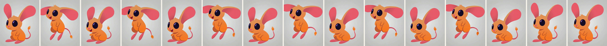

Clip: [`14-excited.mp4`](../public/dibs/motion/14-excited.mp4)

5 s · seed 1
> The cartoon jerboa bounces up and down three times with small springy hops, not frantic. The ears flap with each bounce and the tail swings. Eyes stay open, same face. Ends in exactly the same seated pose. Static camera, plain grey background.

### 15 Head shake (no)

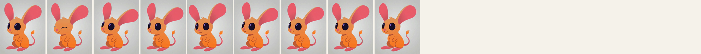

Clip: [`15-head-shake.mp4`](../public/dibs/motion/15-head-shake.mp4)

3 s · seed 1
> The cartoon jerboa gives a small head shake, turning the head slightly left and right twice. The head stays level and the body stays completely still. Eyes stay open, same face. Ends in exactly the same seated pose. Static camera, plain grey background.

### 16 Look left and right

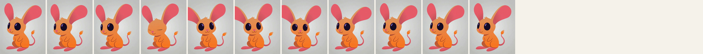

Clip: [`16-look-left-right.mp4`](../public/dibs/motion/16-look-left-right.mp4)

3.5 s · seed 1
> The cartoon jerboa slowly turns its head a little to the left, then a little to the right, then back to center. The head stays level and the body stays still. Eyes stay open, same face. Ends in exactly the same seated pose. Static camera, plain grey background.

### Entrances and exits

These start or end on the empty plate instead of looping.

### 17 Hop in from the right


Clip: [`17-hop-in-right.mp4`](../public/dibs/motion/17-hop-in-right.mp4)

4 s · seed 1 · empty plate → keyframe
> The cartoon jerboa hops into the frame from the right edge with quick, springy hops, short hang time, at natural speed, and lands in its seated pose. On the way up the ears trail behind, on landing they flop forward and settle; the tail swings for balance. Eyes stay open, same face. Static camera, plain grey background.

### 18 Drop in from above

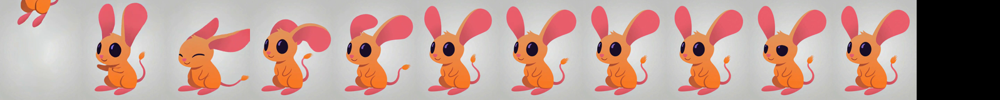

Clip: [`18-drop-in.mp4`](../public/dibs/motion/18-drop-in.mp4)

3.5 s · seed 1 · empty plate → keyframe
> The cartoon jerboa drops into view from above the top edge of the frame and lands in its seated pose with a small bounce, at natural speed. On the way up the ears trail behind, on landing they flop forward and settle; the tail swings for balance. Eyes stay open, same face. Static camera, plain grey background.

### 19 Jump in from below

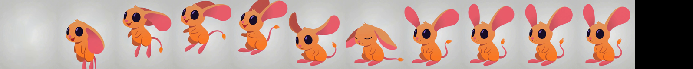

Clip: [`19-jump-in.mp4`](../public/dibs/motion/19-jump-in.mp4)

3.5 s · seed 1 · empty plate → keyframe
> The cartoon jerboa jumps up into view from below the bottom edge of the frame, arcs up, and lands in its seated pose, at natural speed. On the way up the ears trail behind, on landing they flop forward and settle; the tail swings for balance. Eyes stay open, same face. Static camera, plain grey background.

### 20 Leap out to the right

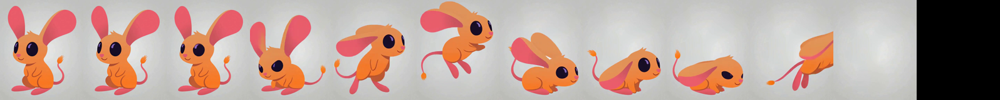

Clip: [`20-leap-out-right.mp4`](../public/dibs/motion/20-leap-out-right.mp4)

3.5 s · seed 1 · keyframe → empty plate
> The cartoon jerboa turns to face right and does one quick, springy leap out of the frame to the right, short hang time, at natural speed. On the way up the ears trail behind, on landing they flop forward and settle; the tail swings for balance. Eyes stay open, same face. Static camera, plain grey background.

## Not covered yet

- **Nod:** not possible with this setup yet. Every nod wording moved the whole body (a bow or bounce), even with "the body stays completely still". Likely a job for the rig or Remotion.
- **Exit left and duck out:** no take held up yet. Exits tend to blink on the turn; entrances that start on the empty plate are more reliable.
- **Idle loop:** a separate Remotion idle kit exists; not part of this set.
- **Other angles and poses:** every recipe was tested on one seated 3/4 keyframe. A new keyframe means re-checking them.
- **Placement on brand backgrounds:** cutouts (matting, green screen) were tested and dropped. Treat the grey clips as reference.
